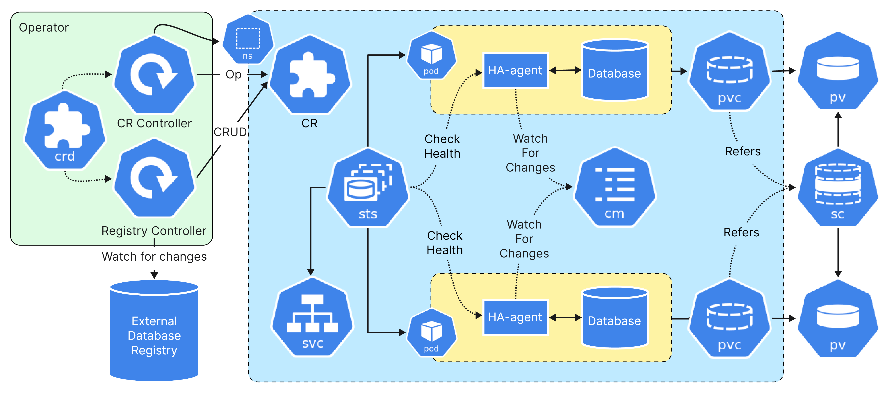
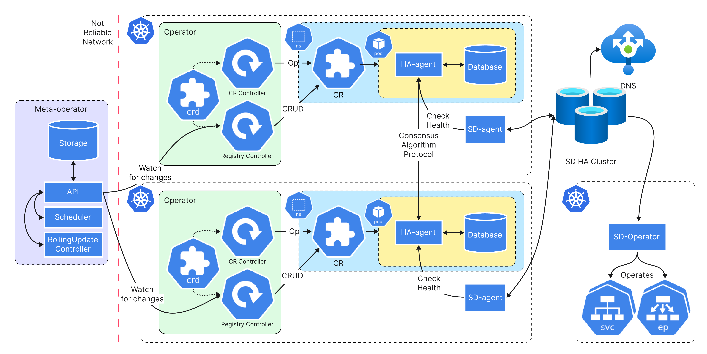

# От самой большой инсталляции PostgreSQL в Европе к платформе управления базами данных

Данный репозиторий содержит дополнительные материалы к докладу
[От самой большой инсталляции PostgreSQL в Европе
к платформе управления базами данных](https://14.codefest.ru/lecture/2775)
конференции [CodeFest 14](https://14.codefest.ru/).

Целиком презентация доступна в директрии `./slides` в форматах `key`, `pptx` и `pdf`.

## Контакты

Связаться с докладчиком и задать вопросы можно через telegram: [@vovik0134](https://telegram.dog/vovik0134).

## Диаграммы

Архитектурные диаграммы из презентации в высоком разрешении.

### Single-cluster architecture

### Multi-cluster architecture

## Дополнительные материалы про DBaaS в Авито

- [Avito Database Meetup #1](https://www.youtube.com/watch?v=BDUgi_ov5pM&list=PLknJ4Vr6efQF0_RIfj8UwXC_RAHDlsPBK) –
рассказываем о том как базы данных работают в Авито: от платформы к реальным кейсам автоматизации.
- [CockroachDB на платформе DBaaS](https://www.youtube.com/watch?v=lF5kB7p6nQY) –
подробно рассказываем зачем в Авито завелся CockroachDB и как мы его приспособили к платформе.
- [Как достать шумного соседа: ограничение дискового ввода-вывода в Kubernetes](https://phdays.com/speakers/page/1/?talk-id=715) –
о том как мы решили проблему "шумных соседей" по диску (ссылка на видео появится сразу, как его опубликуют).